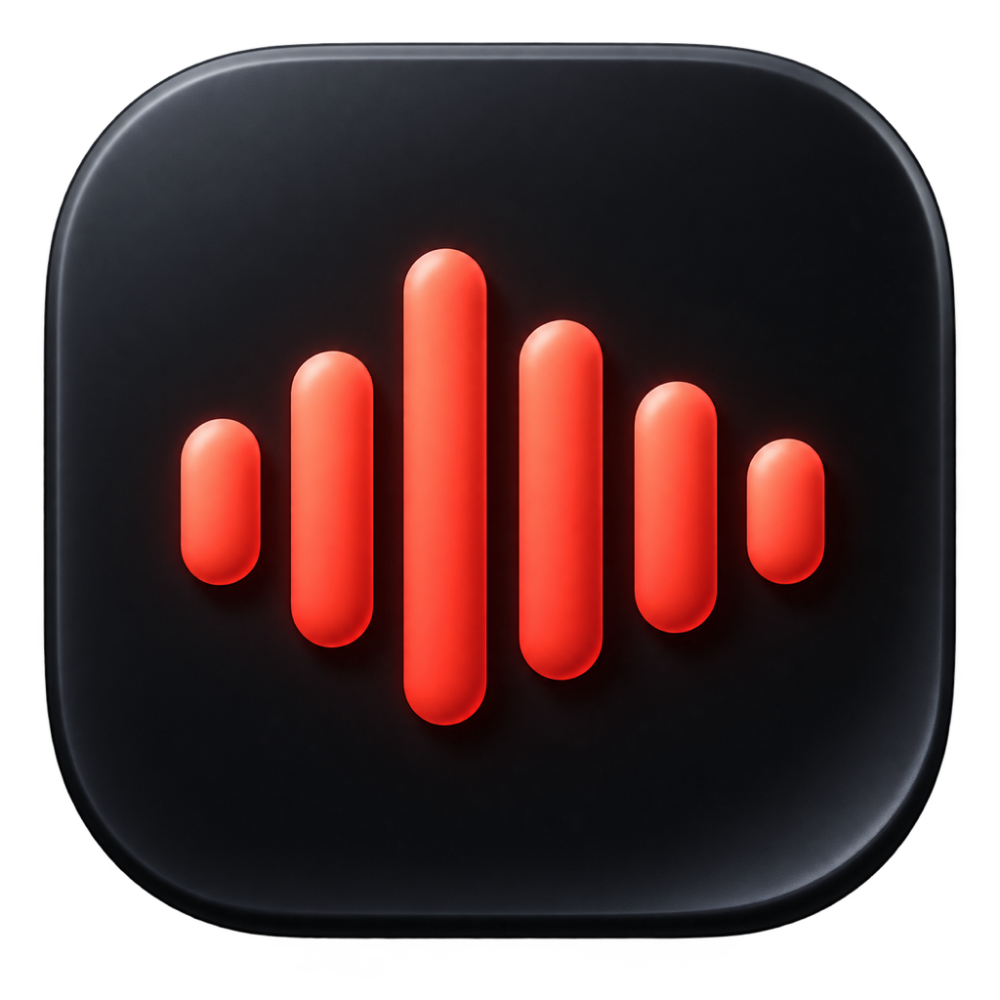
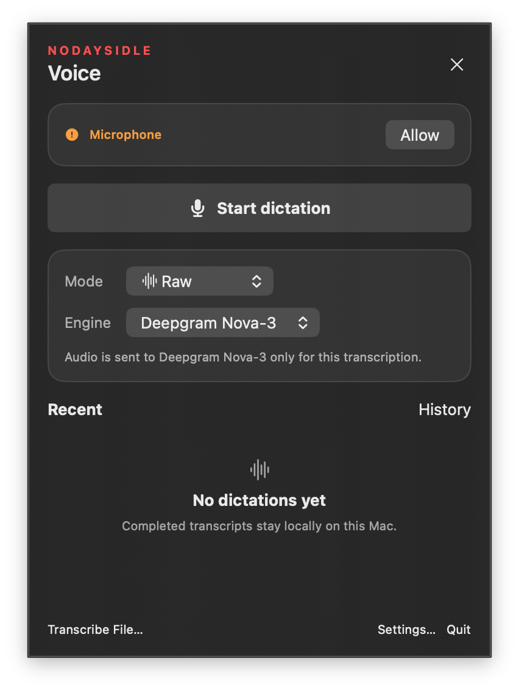
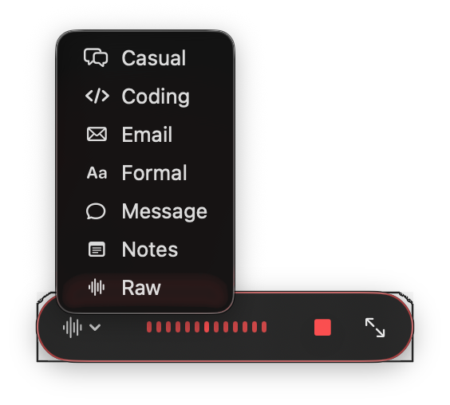

<div align="center">
  
  <h1>NODAYSIDLE Voice</h1>
  <p><strong>Native menu-bar dictation for macOS.</strong></p>
  <p>Hold → speak → release. Only finished text is inserted.</p>

  <p>
    <a href="https://github.com/nodaysidle/nodaysidle-vois/releases/download/v0.2.0/NODAYSIDLE-Voice-0.2.0.dmg"><strong>Download v0.2.0 DMG</strong></a>
    ·
    <a href="https://github.com/nodaysidle/nodaysidle-vois/releases/tag/v0.2.0">v0.2.0 release</a>
    ·
    <a href="https://github.com/nodaysidle/nodaysidle-vois/releases">All releases</a>
  </p>

  <p>
    
    
    
    <a href="https://github.com/nodaysidle/nodaysidle-vois/releases/latest"></a>
  </p>
</div>

<table>
  <tr>
    <td width="54%" align="center"></td>
    <td width="46%" align="center"></td>
  </tr>
</table>

macOS only (Apple silicon). Native SwiftUI/AppKit menu-bar app — not iOS, not Android, not a web app.

## The journey

One loop:

```text
Hold ⌃ Space
  → speak
  → release
  → transcribe (selected STT engine)
  → insert finished text only at the previous cursor
```

| Stage | What happens |
|---|---|
| **Hold** | Capsule appears. Idle shows a mic; recording shows a waveform. |
| **Speak** | Audio is captured. Deepgram streams live words in the capsule (display only). |
| **Release** | Capsule shows a spinner while processing. |
| **Insert** | Only the completed transcript is pasted or copied. Partials never go to the cursor. |
| **Done** | Short success check, then the capsule hides (it does not stay idle on screen by default). |

Dictation never opens or focuses Control Center. Escape cancels an active job.

Languages: **Automatic** / **EN** / **IT** / **SL**, sent to the selected engine. Deepgram uses multilingual Nova-3 when Automatic is selected.

## What’s on screen (v0.2.0)

| Surface | Role |
|---|---|
| **Capsule** | Compact HUD during recording/processing. Wordless chrome: mic / waveform / spinner. Hover controls; mode menu; Deepgram live words when streaming. |
| **Control Center** | 380×520 secondary panel: start dictation, mode/engine/language, recent history. Opened explicitly — not by starting dictation. |
| **Settings** | 980×680: general, hotkeys, providers, local models, history, vocabulary, privacy. |
| **Menu bar** | Status item; opens Control Center. |

Optional “keep capsule visible while idle” lives in Settings; default is off.

## Engines / models

BYOK. No API keys or models ship in the app.

| Engine | Role | Network |
|---|---|---|
| **WhisperKit (local)** | On-device STT after you download a model. Kept warm when selected. | Offline after download |
| **Deepgram Nova-3** | Streaming STT. Preferred when a Deepgram key is saved and no local model is installed. Live words in the capsule. | Active-request audio to Deepgram |
| **OpenRouter STT** | Batch STT. Optional OpenRouter text refinement after the transcript. | Active-request audio/text to OpenRouter |

Vocab hints bias Whisper prompts / Deepgram keyterms. Deterministic replacements run after the transcript. Keys live in Keychain and enter memory only for the active request.

## Stack

| Layer | Technology |
|---|---|
| UI | SwiftUI + focused AppKit bridges |
| Hotkeys | Carbon global hotkeys |
| Audio | AVFoundation |
| Local STT | WhisperKit / Core ML |
| Cloud STT | URLSession → Deepgram / OpenRouter |
| Secrets | Security / Keychain |
| History & settings | SwiftData (local) |

## Install

1. Download [`NODAYSIDLE-Voice-0.2.0.dmg`](https://github.com/nodaysidle/nodaysidle-vois/releases/download/v0.2.0/NODAYSIDLE-Voice-0.2.0.dmg) from the [v0.2.0 release](https://github.com/nodaysidle/nodaysidle-vois/releases/tag/v0.2.0).
2. Open the DMG and drag **NODAYSIDLE Voice** to **Applications**.
3. Ad-hoc signed, not notarized. First launch: Control-click the app → **Open** → confirm **Open**.
4. Grant microphone access. Grant Accessibility only if you want automatic insertion into other apps.
5. Download a local Whisper model, and/or save your own Deepgram / OpenRouter key in Settings.

Requires **macOS 14+** on **Apple silicon**.

## Shortcuts

| Action | Default |
|---|---|
| Hold to dictate | `⌃ Space` |
| Toggle dictation | `⇧ ⌥ Space` |
| Cancel | `Escape` |

`⌃ Space` leaves `⌥ Space` free for Raycast. Change shortcuts in Settings → Hotkeys.

## Privacy

- Provider keys: Keychain only.
- Temporary mic audio: owned by the active request; removed after success or discard.
- Completed transcripts: local SwiftData; no audio stored with history.
- Cloud transfer: only when you select a cloud engine, for that request.
- Local Whisper: works offline after an explicit model download. Cloud engines need the network.

No accounts, payments, or cloud sync of notes.

## Build from source

Xcode Command Line Tools with Swift 6.2:

```bash
swift test
swift build -c release
./Scripts/package_app.sh
open "NODAYSIDLE Voice.app"
```

DMG for GitHub Releases:

```bash
./Scripts/package_dmg.sh
```

Artifacts land in `dist/` with `SHA256SUMS.txt`. Version comes from `version.env`.

## Repository map

```text
nodaysidle-vois/
├── Assets/                 # app + menu-bar artwork
├── Artifacts/UI-Audit/     # UI screenshots
├── Resources/              # bundled non-secret resources
├── Scripts/                # package_app / package_dmg
├── Sources/NODAYSIDLEVoice/
│   ├── Models/             # domain + SwiftData
│   ├── Services/           # audio, hotkeys, providers, Keychain
│   └── Views/              # capsule, Control Center, Settings
├── Tests/                  # focused unit + smoke coverage
├── version.env             # MARKETING_VERSION / BUILD_NUMBER
└── PRD.md / ARD.md / TRD.md / TASKS.md
```

---

<div align="center">
  Built by <a href="https://github.com/nodaysidle">NODAYSIDLE</a>.
</div>
